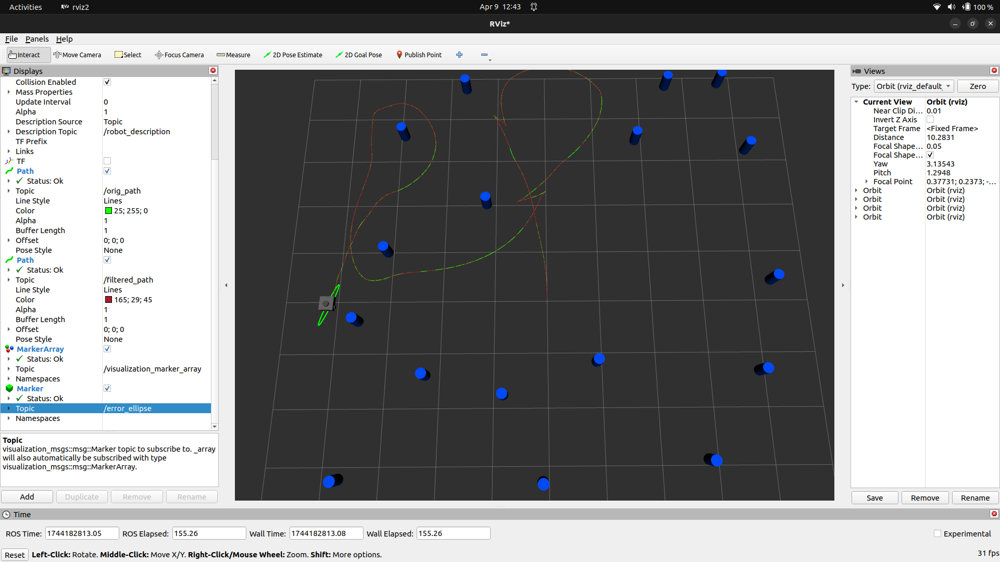
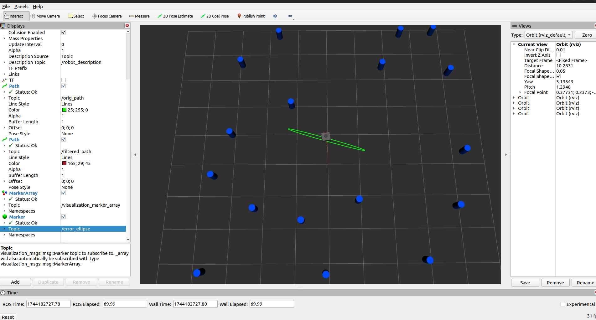

# EKF Localization and SLAM ROS2

## Overview
The EKF Localization and SLAM ROS2 repository provides an implementation of an Extended Kalman Filter (EKF) based localization and SLAM (Simultaneous Localization and Mapping) framework using ROS2. This project is designed as a modular and extendable codebase that leverages sensor fusion to accurately estimate the robot’s state and build maps of its environment.

Key features of the project include:
- EKF-based sensor fusion: Integrates various sensor inputs (e.g., odometry, IMU, LiDAR) using EKF for robust state estimation.
- SLAM implementation: Offers a method for creating maps on-the-fly while localizing the robot in an unknown environment.
- ROS2 integration: Leverages ROS2 for inter-process communications, with nodes well-structured for sensor data management, filter processing, and visualization.
- Simulation support: Includes launch files for running simulations in environments like Gazebo, making it easier to test in a virtual world before real-world deployment.

## Repository Structure
```
EKF_localization_and_SLAM_ROS2/
├── src/
|   ├── my_launch_files/launch
|   |   ├── cylin_world.launch.py
|   |   ├── ekf_launch.py
|   ├── py_pubsub/py_pubsub
|   |   ├── EKF_localization.py
|   |   ├── m2C.py
|   |   ├── EKF_slam.py  
|   ├── maps
|   ├── worlds
|   ├── cpp_pubsub
├── media/
│   ├── screenshot1.png
│   ├── screenshot2.png
│   ├── screenshot3.png
│   └── demo_video.webm

```

## Requirements
- Operating System: Ubuntu 20.04 LTS or later (Ubuntu 22.04 LTS recommended)
- ROS2 Distribution: Foxy, Galactic, Humble, or later (tested with Humble)
- Programming Languages: C++ and Python
- Dependencies:
  - Eigen
  - OpenCV
  - ROS2 packages like sensor_msgs, nav_msgs

## Installation

1. Clone the Repository:
```
git clone https://github.com/VyomVyas25/EKF_localization_and_SLAM_ROS2.git
cd EKF_localization_and_SLAM_ROS2
```

2. Install Dependencies:
```
sudo apt update
sudo apt install ros-humble-eigen3-cmake-module ros-humble-<other-required-packages>
```

3. Build the Workspace:
```
colcon build --symlink-install
source install/local_setup.bash
```

## Usage

### Launching the EKF Localization Nodes using a launch file
```
ros2 launch my_launch_files ekf_launch.py
```

### Launching the SLAM Module
```
ros2 launch ekf_localization slam.launch.py
```

## Media

To help illustrate the functionality and setup of the system, the repository includes several images and a demo video:

- Screenshots:  
  - 

  -   

- Demo Video:  
  - [Watch the Demo](media/demo_video.webm)

## Troubleshooting

- Build Errors:  
  ```
  rm -rf build install log
  colcon build --symlink-install
  ```

- Sensor Data Issues:  
  Check sensor topics and configuration files.

- Visualization Problems:  
  Ensure RViz config file is correctly loaded.


## Contact

Open an issue on the GitHub repository or use repository communication channels.
